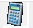
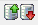
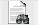
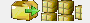
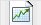
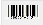
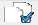
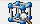
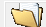

## Barra auxiliar Artículos

Al igual que en los demás apartados del sistema, econtraremos una barra de navegación auxiliar que nos permitirá realizar las distintas operaciones.

Antes de continuar con la pantalla principal de la sección de artículos visualizaremos la barra y sus funcionalidades.

:::tip[Consejo]
Al mantener el puntero encima de cada botón aparecerá una leyenda indicando la funcionalidad del mismo.
:::

*      **Salir** : Sale de la pantalla actual.
*  **Primero**: Nos desplaza al primer registro. *(El registro con el código más pequeño)*
*  **Ultimo**: Nos desplaza al último registro.
*  **Anterior**: Nos desplaza un registro hacia atras.
*  **Siguiente**: Nos desplaza un registro hacia delante.
*  **Alta**: Da de alta un nuevo registro.
*  **BAJA**: Da de baja el registro actual.
*  **Modificar**: Modifica el registro actual.
*  **Imprimir**: Muestra por pantalla una serie de listados.
*  **Exportar a Excel**: Exporta la ficha del artículo a Microsoft Excel.
*  **Calculadora**: Abre la calculadora del sistema.
*  **Búsqueda**: Realiza una búsqeuda de artículo introduciendo el código directamente, introduciendo el comienzo de su descripción o usando el comodín **"*"** y a continuación algo que esté incluido en cualquier parte del nombre.
*  **Orden**: Cambia el criterio de avenze o retroceso de los registros, por código o por nombre.
*  **Extracto Movimientos**: Permite visualizar de manera grafica un extracto de movimientos del artículo.
*  **Envases**: Permite asociar el artículo con su respectivo envase.
*  **Lotes**: Permite indicar que el artículo en pantalla está compuesto por otros artículos.
    :::info[Información]
    Para que esta función funcione correctamente el artículo ha de ser tipo L (Lote).
    Se utiliza por ejemplo para cestas de navidad etc...
    :::
*  **Gráfico**: Cambia el modo de visualización de la ficha de artículo para ver los totales de movimientos del mismo acumulados por mes/año.

*  **Memo**: Información en texto libre para el artículo.

*  **Códigos de barra adicionales**: Permite asociar al artículo en pantalla más códigos de barras dependiendo del proveedor que lo suministre.

*  **Clientes pendientes suministro**: Muestra los clientes a los que no se les ha podido servir este producto.

*  **Trazabilidad**: Muestra la pantalla de control de lotes y trazabilidad.
    :::warning Aviso: Trazabilidad
    Debe activarse previamente el módulo por parte del soporte técnico de Megas.

    Una vez activo el módulo se desactivará automaticamente la posibilidad de modificar manualmente el stock de nuestros almacenes.
    :::

*  **Duplicar**: Permite duplicar la ficha del artículo incluyendo stock, precios especiales, promociones...

*  **Promociones del artículo**: Muestra la pantalla de las promociones en las que está incluido el artículo en pantalla.

*  **Pendiente Recibir**: Muestra por pantalla los albaranes de compra pendientes de servir que incluyen el artículo.

*  **Margenes por Tarifa**: Muestra una ventana la cual nos permite mediante la introducción del % que deseemos modificar rápidamente las tarifas.

*  **Cubo Decisión**: Exporta a un programa de minería de datos las diferentes estadísticas donde aparezca el artículo que estamos visualizando.

*  **Documentos Asociados**: Muestra una pantalla donde podremos incorporar aquellos documentos relacionados con nuestro artículo.

*  **Imagen Producto**: Permite la visualización por pantalla de la imagen del producto.

    :::info
    Para que esta funcion funcione correctamente deberemos tener previamente incorporado en la ruta "\POCKET\Imagenes" las imagenes en formato JPG o PNG de nuestros artículos nombrados bien con su Código o bien por proveedor mediante P_XXX siendo P el prefijo y XXX el código de proveedor.
    :::

*  **Carrito de compra**: Permite ir añadiendo al carrito de compra las unidades del artículo que deseemos.
