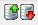
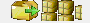
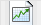

## Barra auxiliar Artículos

Al igual que en los demás apartados del sistema, econtraremos una barra de navegación auxiliar que nos permitirá realizar las distintas operaciones.

Antes de continuar con la pantalla principal de la sección de artículos visualizaremos la barra y sus funcionalidades.

:::tip[Consejo]
Al mantener el puntero encima de cada botón aparecerá una leyenda indicando la funcionalidad del mismo.
:::

*      **Salir** : Sale de la pantalla actual.
*  **Primero**: Nos desplaza al primer registro. *(El registro con el código más pequeño)*
*  **Ultimo**: Nos desplaza al último registro.
*  **Anterior**: Nos desplaza un registro hacia atras.
*  **Siguiente**: Nos desplaza un registro hacia delante.
*  **Alta**: Da de alta un nuevo registro.
*  **BAJA**: Da de baja el registro actual.
*  **Modificar**: Modifica el registro actual.
*  **Imprimir**: Muestra por pantalla una serie de listados.
*  **Exportar a Excel**: Exporta la ficha del artículo a Microsoft Excel.
*  **Calculadora**: Abre la calculadora del sistema.
*  **Búsqueda**: Realiza una búsqeuda de artículo introduciendo el código directamente, introduciendo el comienzo de su descripción o usando el comodín **"*"** y a continuación algo que esté incluido en cualquier parte del nombre.
*  **Orden**: Cambia el criterio de avenze o retroceso de los registros, por código o por nombre.
*  **Extracto Movimientos**: Permite visualizar de manera grafica un extracto de movimientos del artículo.
*  **Envases**: Permite asociar el artículo con su respectivo envase.
*  **Lotes**: Permite indicar que el artículo en pantalla está compuesto por otros artículos.
    :::info[Información]
    Para que esta función funcione correctamente el artículo ha de ser tipo L (Lote).
    Se utiliza por ejemplo para cestas de navidad etc...
    :::
*  **Gráfico**: Cambia el modo de visualización de la ficha de artículo para ver los totales de movimientos del mismo acumulados por mes/año.

*  **Memo**: Información en texto libre para el artículo..