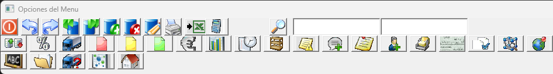
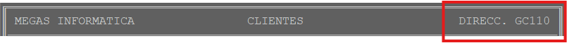
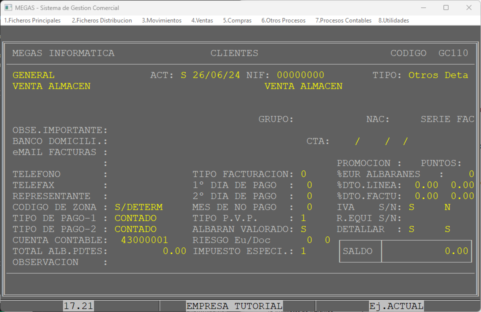
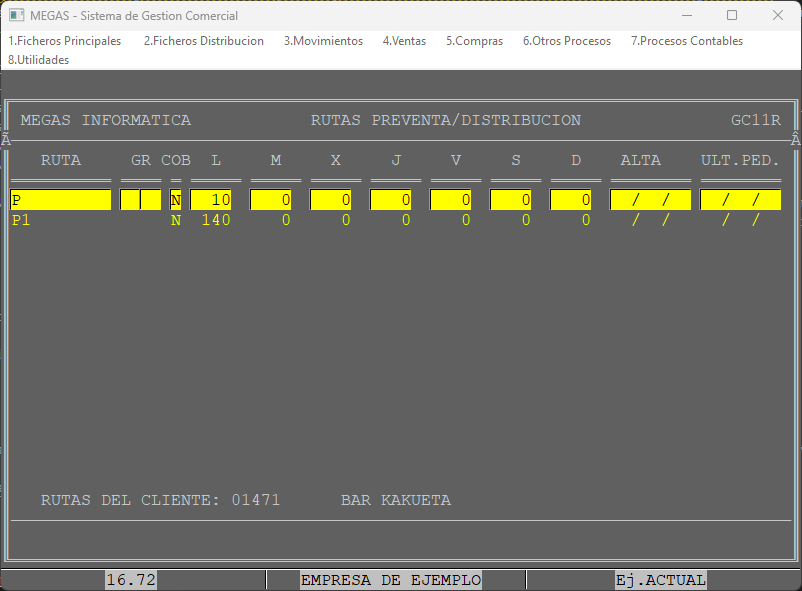
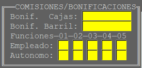

## Clientes
En esta pantalla mediante las opciones de menú, podremos consultar diferentes datos de interés, además de realizar las operaciones básicas sobre cada uno de nuestros clientes.

A la hora de dar de alta un cliente, el programa exigirá la **introducción de datos** que considera **importantes** para su gestión, dejando la posibilidad de dejar en blanco aquellos que por lógica carecen de tanta importancia.

Esta obligatoriedad se pondrá de manifiesto en diferentes mensajes de error bien al dejar un **campo obligatorio en blanco o al terminar de recorrer todos los campos de la ficha**

### Barra Navegación Clientes

Antes de avanzar con la pantalla principal, mostraremos la barra principal de navegación de la pantalla clientes, que dependiendo en que apartado del programa nos encotremos tendra un aspecto diferente.

> Nos desplazaremos de izquierda a derecha explicando la funcionalidad de cada botón.
>
> Dejando el puntero encima de cada botón nos mostrará una ventana emergente con su funcionalidad.
>
> Botones Primera fila

* **Salir**: Botón principal para salir de la pantalla actual.
* **Primero**: Este botón nos llevará al primer registro.
* **último**: Este botón nos llevará al último registro.
* **Anterior**: Nos desplaza un registro anterior. *(Se puede usar la combinacion Ctrl + Flecha izquierda)*
* **Posterior**: Nos desplaza un registro posterior. *(Se puede usar la combinacion Ctrl + Flecha derecha)*
* **Alta**: Da de alta un registro nuevo. *(Se puede usar la combinación Ctrl + A)*
* **Baja**: Da de baja el registro actual. *(Se puede usar la combinación Ctrl + B)*
* **Modificar**: Modifica el registro actual. *(Se puede usar la combinación Ctrl + M)*
* **Imprimir**: Nos muestra una ventana emergente con una serie de acciones. (Se detallan en el apartado de funcionalidades de cliente)
* **Exportar**: Exporta la ficha a excel. *En desuso*
* **Calculadora**: Abre la calculadora por defecto del sistema.
* **Búsqueda I**: Permite buscar por nombre, dirección o código. Permite a su vez buscar introduciendo parte de la palabra.
  * **$**: Mediante el carácter **dolar($)(Mayús + 4 )** permite buscar por registros dados de baja.
* **Búsqueda II**: Permite buscar por dirección.

> Botones segunda fila

* **Orden**: Permite cambiar el orden de búsqueda de registro.
  > 
* **Precios especiales**: Permite visualizar los precios especiales asignados al cliente.
* **Rutero**: Accede a la pantalla de rutas de distribución asignadas al cliente.
* **Pedidos**: Accdede al apartado de pedidos del cliente.
* **Albaranes**: Accede al apartado de albaranes del cliente.
* **Facturas**: Accede al apartado de facturas del cliente.
* **Vencimientos**: Accede a los vencimientos de facturas del cliente.
* **Ventas**:
* **Histórico de pvp**:
* **Stock de depósitos/Envases**:
* **Artículos pendientes de suministro**:
* **Información Comercial**:

Procederemos a detallar cada aspecto de la **ficha de clientes**.
>*Todos los campos se recorren de izquierda a derecha*

* **Código cliente**: Es un código **alfanumerico** por el cual el usuario del programa identifica a cada uno de sus clientes.
    > Es aconsejable codificar los códigos con 5 carácteres numéricos a fin que que la **cuenta contable** y el **código de cliente** mantengan cierta relación.
    >
    >El programa genera automáticamente la cuenta contable si el código es numerico, por ejemplo si nuestro cliente está codificado como 00043, su cuenta contable se generará como: 43000043.
    >
    > *Si durante el proceso de alta se introduce el símbolo '+' en el campo de código de cliente, el programa genera automáticamente un número de cliente correlativo.*
* **Código Sucursal**: **POR RELLENAR**

* **Activo (ACT)**: Indica el estado del cliente, admite tres tipos de estado
  * **S (Sí)**: El cliente se encuentra activo y se pueden realizar operaciones sobre el.
  * **N (No)**: El cliente ya no está activo y hay que indicar la **fecha de baja**. Ya no se podrá realizar ninguna operación sobre el exceptuando consultas.

  * **I (Inactivo)**: El cliente ya no está activo pero no necesariamente cerrado. Se utiliza para aquellos clientes que cesan su actividad durante un determinado periodo de tiempo.

* **NIF**: Este campo se rellena con una estructura determinada que es Número-Letra. El programa es capaz de determinar por sí solo la letra que acompaña el número.
    > En el caso de que sea DNI no calculará la letra.

* **TIPO**: Hace referencia al tipo de cliente. Lleva asociado una tabla con los códigos de todos los tipos disponibles.

* **DATOS FISCALES**: Consiste en un bloque de cuatro lineas:
  * **Nombre Fiscal**: Nombre fiscal del cliente.
  * **Dirección**: Dirección fiscal del cliente.
  * **Código Postal y Localidad**: Sigue una estructura determinada (*CP-Localidad*).
  * **Provincia**: Provincia.

> Siguiendo el orden de izquierda a derecha se nombran los siguientes campos.

* **DATOS COMERCIALES**
  * **Nombre Comercial**: Nombre comercial del cliente (Establecimiento).
  * **Dirección Comercial.**
  * **Código Postal y Localidad**: Sigue la misma estructura que los datos fiscales.

* **GRUPO**: Esta campo permite agrupar varios clientes con un denominador común, con el fin de hacer referencia al grupo creado en otras secciones del programa.

> Por ejemplo a la hora de crear promociones que afecten a un determinado grupo de clientes.

Para hacer uso de este campo primero ha de dar de alta los grupos en la sección **153-Grupos de cliente.**

* **NAC**: Indica si se trata de un cliente nacional. Entendemos por cliente nacional a todo aquel cliente al que el proveedor le factura directamente.
    > Para dar de alta un cliente nacional se deberá hacer desde el apartado **157-Clientes - Proveedores.**

* **SERIE FAC**: **POR RELLENAR**

* **OBSERVACIÓN IMPORTANTE**: Es un campo libre que sirve para introducir una información relativa a ese cliente, la cual **aparecerá por pantalla**, a modo de aviso, cada vez que realicemos una operación sobre ese cliente.
  > Ej: Avisar antes de servir.

* **BANCO DOMICILIADO**: Nombre del banco domiciliado.
* **Cuenta bancaria (CTA)**: Número de cuenta bancaria, se introduce todos los dígitos seguidos.
  > El programa realiza una validación mediante el dígito de control (D.C.) si el número de cuenta introducido es válido, mostrando un mensaje de error en caso de que no lo sea.

* **EMAIL FACTURAS**: Mediante este campo podremos introduccir hasta dos direcciones de correo las cuales se usarán para el envío de los documentos a través de email. *Se debe tener configurado correctamente los parámetros de email*

* **TELEFONO**: Número de telefono del cliente.
* **TELEFAX**: Número de FAX del cliente.
* **REPRESENTANTE**: Código del preventista que visita al cliente.
    >Para poder asignar un representante, deberemos darlo de alta previamente en el sistema mediante *22.Personal*.
* **CÓDIGO DE ZONA**: El programa permite ubicar a los clientes en zonas con el fin de obtener información estadística basándose en ese critrerio. <!-- Añadir desde donde se dan de alta las zonas -->
* **TIPO DE PAGO-1**: Tipo de pago referentes a las operaciones A.  <!-- Añadir desde donde se añaden las formas de pago. -->
* **TIPO DE PAGO-2**: Tipo de pago referente a las operaciones B.

* **CUENTA CONTABLE**: Código generado automáticamente por el programa al dar de alta un cliente con código numérico.

* **TOTAL ALBARANES PENDIENTES**: Es el importe total al que ascienden todos los albaranes del cliente que están **pendientes de ser facturados**. Este dato se genera de manera **automática**.
  >En algunos casos y debido al erroneo mantenimiento de la base de datos este campo puede arrojar una cantidad diferente a la real. Para ello utilizaremos el recálculo de saldos.

* **OBSERVACION**: Campo destinado a una observación interna. Este campo no se refleja en ingun lugar más alla de la ficha de cliente.

* **TIPO DE FACTURACION**: Se utiliza para configurar la facturación automática. Para este campo existen las siguientes opciones:
  * **0**: Factura resumen, es decir, todos los albaranes se agrupan bajo una misma factura.
      >Si se utiliza la opción de *Documentación de cargas* se facturará todos los albaranes que el cliente tenga en esa carga.
  * **1**: Factura directa. Se creará una factura por cada albaran.
  * **2**: Sin factura. Generalmente se utiliza para clientes considerados como Nacionales.
  * **3**: Variación de factura resumen. Mediante esta opción se evitará que se facture en documentación de cargas pero mantendra la factura por agrupación.
  * **4**: Variación de factura directa. Mediante esta opción se evitará que se facture en documentación de cargas.
* **1º DIA DE PAGO**: Día del mes en el que se gira la factura en el caso de que el cliente sea de crédito.
  > Vease formas de pago: ![Formas de pago]<!-- Añadir enlace directo a formas de pago -->
* **2º DIA DE PAGO**: Día del mes en el que se vuelve a girar la factura en caso de que no se haya efectuado el pago en el primer día de pago.
* **MES DE NO PAGO**: Número del mes en el que el cliente no hace efectivo ningún pago.
  > Ej: Mes 7 (Agosto) porque el cliente se encuentra de vacaciones.

* **TIPO PVP**: Indica la tarifa de precios que se aplicará al cliente. Por defecto la tarifa 1.
* **ALBARÁN VALORADO**: Hay dos posibles valores **S** o **N**:
  * **S (Sí)**: Albarán valorado, cada linea del albarán se imprime con precios y totales.
  * **N (No)**: Albarán sin valorar, cada linea del albarán se imprime solo con la cantidad.
* **RIESGO**: Cantidad en Euros o en facturas que se le concede al cliente con el fin de que cuando **la deuda** llegue al valor introducido nos muestre un aviso y se impida seguir realizando operaciones de venta sobre el. <!-- Revisar y redactar este apartado mejor -->
* **IMPUESTO ESPECIAL**: Código numerico predefinido que se asigna a aquellos clientes.
  * **0**: Impuesto Alcohol Exento.
  * **1**: Impuesto Alcohol Península.
  * **2**: Impuesto Alcohol Canarias.
* **PROMOCION**: Valor S/N. Indica si se le aplicarán las promociones **generales**.
* **PUNTOS**: Valor S/N. Indica si el cliente puede acumular puntos por compra.
* **%EUR ALBARANES**: Cantidad en **porcentaje** de descuento que se aplicará a los albaranes del cliente de forma **general**.

> Los siguientes campos vienen divididos en dos columnas para la facturación de la serie C (Facturación en A) y para la facturación de la serie F (Facturación en B).
<!-- Incicio de la tabla -->

|                     | FACTURACIÓN EN C                         | FACTURACIÓN EN F                          |
|---------------------|--------------------------------------------|--------------------------------------------|
| % DTO. LÍNEA        | Descuento que se le aplicará en cada linea de albarán            | Descuento que se le aplicará   en cada linea de albarán           |
| % DTO. FACTU        | Descuento que se le aplicará  en cada factura             | Descuento que se le aplicará  en cada factura             |
| IVA                 | S/N. Indica si se le aplicará IVA                                      | S/N. Indica si se le aplicará IVA                                        |
| R. EQUI             | S/N. Indica si se le aplicará Recargo de Equivalencia                                     | S/N. Indica si se le aplicará Recargod de equivalencia                                        |
| DETALLAR            | S/N. Indica si en una factura resumen aparecen los albaranes detallados o si de lo contrario aparece el número de albarán y el total del mismo.                                    | S/N. Indica si en una factura resumen aparecen los albaranes detallados o si de lo contrario aparece el número de albarán y el total del mismo.                                        |

<!-- Fin de la tabla -->

* **SALDO**: Indica en cantidad de Euros el saldo de facturas pendientes de cobro.

>**Al terminar de introducir los datos en esta pantalla el programa irá presentando las distintas advertencias de datos de caráter obligatorio no introduccidos o erroneos que deberemos subsanar para continuar.**

## Rutas Cliente

En esta pantalla podremos asignar las distintas rutas a los clientes. Para ello primeramente deberemos de haber dado de altas las rutas en *20.Rutas* <!-- Introduccir redirección a rutas -->

A continuación se detallan los campos:

* **RUTA**: Código de ruta asignado.
* **GR**: Sirve para definir rutas referentes a familias de producto.
  > Esto es útil cuando, teniendo en nuestro almacén varios productos, utilizamos rutas que distribuyen **sólo** un producto.
  >
  >Ej; Agua, cerveza, leche...
* **COB (Cobrar)**: Admite sólo dos valores, S(Sí) y N(No). Indica si en la ruta asociada se cobrarán automáticamente los albaranes.
* **CAMPOS L A D (Días de la semana)**: Orden de visita del cliente en el rutero.
  > El orden de visita es preferible introducirlo de 10 en 10 por si se desea introduccir alguno nuevo entre medias.
  >
  > En caso de no disponer de espacio en los ordenes de visita, el programa dispone de una funcion de **reorganización de rutas** <!-- Introduccir redirección a reogranizar rutas -->que los volverá a colocar de 10 en 10.

* **ALTA**: Fecha de alta de la ruta. Se coge por defecto la fecha actual.
* **ULT PED (Último pedido)**: Fecha de último pedido que el cliente ha realizado.

## Comisiones/Bonificaciones Cliente

### ➡️ Bonificaciones

En esta pantalla se hace referencia a las bonificaciones destinadas a **incentivar el consumo de este cliente**. Este tipo de bonificaciones supone una cantidad en **Euros** que el concesionario otorga a un cliente en **función al consumo que realice en un tiempo estipulado**.
Estas bonificaciones no tienen por qué existir, a no ser que el concesionario las haya pactado con aterioridad con el cliente.

Para asignar las bonificaciones deberemos realizar unos pasos previos:

* 1º: Asignar los tramos de bonificación <!-- Insertar referencia a bonificaciones y redirección a las bonificaciones -->
* 2º: Crear las bonificaciones.

**En la siguiente imagen se muestra la pantalla de comisiones y bonificaciones de la ficha de un cliente.**
<!-- Insertar cómo llegar a esta pantalla -->

En la imagen apreciamos los siguientes campos:

* **Bonif. Cajas (Bonificaciones por Caja)**: Código de bonificación por cajas.
* **Bonif. Barril (Bonificaciones por Barril)**: Código de bonififación por barril.

  > Estos códigos se asignan de manera automática utilizando el proceso de Asignar códigos de bonificación <!-- Introduccir redireccíon a códigos de bonificación -->![Asignar códigos de bonificación]

### ➡️ Comisiones

En esta pantalla, además, se reflejan las comisiones que perciben nuestros empleados o autónomos por realizar su función a este cliente en cuestión.
Las ***comisiones simples*** se crean en una tabla dispuesta para ello en la opción ***2.8.1-Comisiones Simples- Mantenimiento*** <!-- Insertar redireccion a comisiones simples -->![Comisiones Simples]
Se aplicarán los códigos de columna de la ***Tabla de Comisiones*** por cada una de las funciones que consideremos y diferenciando si nuestro personal es empleado o autónomo.
