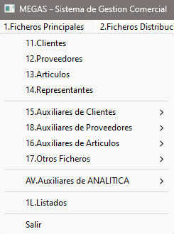

## Ficheros Principales

En este apartado encontramos todo lo relacionado con el funcionamiento **básico** de la aplicación y su correcto mantenimiento.

## Clientes

En esta pantalla se pretende, además de recoger los datos propios de cada cliente, definir el comportamiento básico de cada uno respecto a nuestro negocio.

- Acceder a Clientes: [Clientes](./Clientes/Pantalla%20Clientes.md)

## Proveedores

En esta pantalla se pretende recoger los distintos proveedores  que nos servirán además de defiinir las diferentes variables de cada uno de ellos y de que forma trabajan con nuestro negocio.

- Acceder a Proveedores: [Proveedores](./Proveedores/Pantalla%20Proveedores.md)
