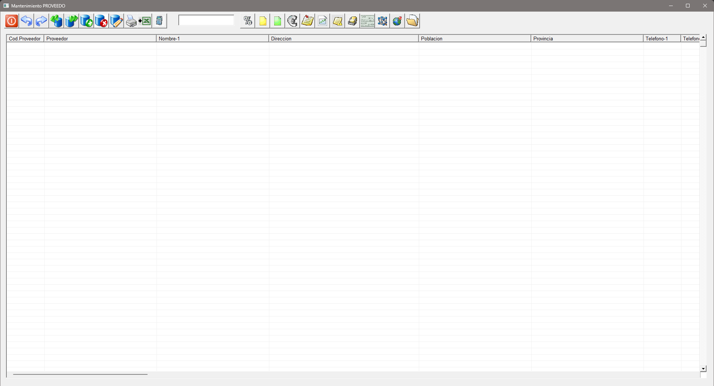
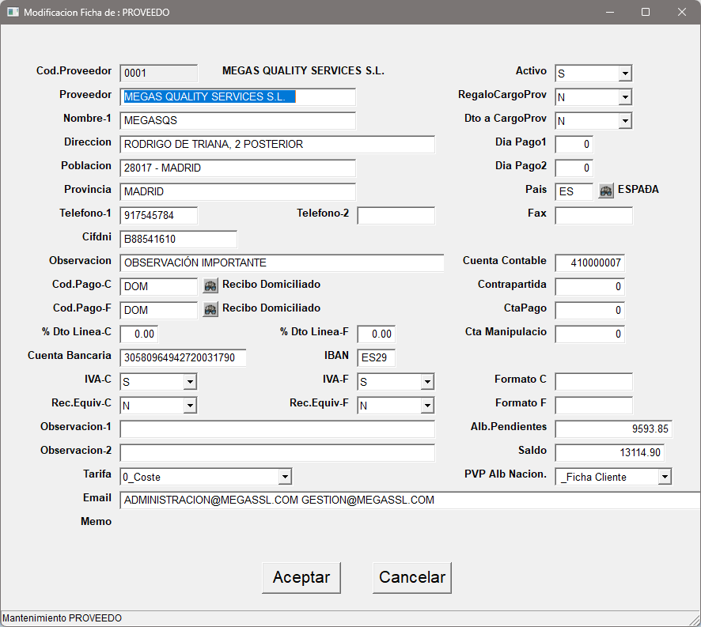

## Proveedores

En este apartado encontraremos todo lo relacionado a nuestros proveedores.

Una vez ingresemos al apartado de proveedores nos encontraremos la siguiente pantalla

> *Procederemos a explicar la botonera de izquierda a derecha*

* **Salir**: Sale de la pantalla actual (Esc).
* **Primero**: Nos lleva al primer registro.
* **último**: Nos lleva al último registro creado.
* **Anterior**: Nos desplaza al registro anterior. ***(Ctrl + izq)***
* **Siguiente**: Nos desplaza al siguiente registro. ***(Ctrl + drch)***
* **Alta**:  Da de alta un nuevo registro. ***(Ctrl + A)***
* **Baja**: Da de baja el registro actual. ***(Ctrl + B)***
* **Modificar**: Modifica el registro actual. ***(Ctrl + M)***
* **Impresión**: Nos permite imprimir dos listados referentes al proveedor seleccionado. Ficha del proveedor o estado de cuenta. ***(Ctrl + I)***
* **Exportar a excel**: Exporta la ficha del proveedor a Microsoft Excel.
* **Calculadora**: Abre la calculadora del sistema.
* **Búsqueda**: Realiza una búsqueda de registro introducciendo el código de proveedor o introduciendo bien parte de su descripción o mediante **"*"** y parte del registro.
* **Precios Especiales**: Nos permite visualizar los precios especiales que nos aplica el proveedor.
* **Pedidos/Albaranes**: Permite visualizar los pedidos/albaranes de compra realizados a este proveedor.
* **Facturas**: Permite visualizar las facturas realizadas a este proveedor.
* **Vencimientos**: Muestra una selección de vencimientos que permite filtrar por vencimientos pagados, no pagados o todos. Al hacer clic sobre el vencimiento en cuestión nos llevará a el. Pulsando escape (ESC) nos devuelve a la pantalla de proveedores.
* **Memo**: Información en texto libre para el proveedor.
* **Gráfica**: Muestra un gráfico con el consumo comparativo de los años anteriores. ***siempre y cuando existan datos***.
* **Artículos pendientes de suministro**: Muestra los artículos del proveedor que están pendientes de servir.
* **Otras direcciones**: Permite registrar otras direcciones, personas de contacto y telefonos del proveedor.
* **Cheques/Pagares**: Permite imprimir un cheque o pagaré al proveedor seleccionado.
* **Cubo de decisión**: Exporta a un programa de minería de datos las diferentes estadísticas del proveedor seleccionado. ***En desuso***.
* **Google Maps**: Permite visualizar la ubicación del proveedor en Google Maps siempre y cuando la dirección esté introduccida correctamente. ***En desuso***.
* **Documentos asociados**: Nos muestra una pantalla donde podemos registrar los documentos asociados al proveedor.
<!-- Introduccir redirección a documentos ascociados. -->

### Alta de un proveedor
 
Mediante la combinación ***Ctrl + A*** se nos mostrará una pantalla donde podremos rellenar los datos de un nuevo proveedor.

> Usaremos los datos de nuestra empresa como ejemplo.

Como hemos visto en otros apartados de la aplicación, nos irá pidiendo unos datos de carácter obligatorio que nos mostrará un mensaje de error ante la ausencia o erronea introducción.

* **Código proveedor**: Código numerico para identificar a proveedor. Al igual que en los clientes es recomendable usar una codificación de cinco dígitos.
* **Proveedor**: Nombre del proveedor.
* **Nombre-1**: Nombre resumen del proveedor.
* **Dirección**: Dirección fiscal del proveedor.
* **Población**: Población y código postal del proveedor. Sigue la codifiación de Código Postal - Ciudad.
* **Provincia**: Provincia.
* **Telefono 1-2**: Teléfono principal del proveedor y un teléfono secundario.
* **CIF/DNI**: CIF del proveedor.
* **Observación**: Observación importante libre del proveedor.
* **Código pago C**: Código de pago para serie C.
* **Código pago F**: Código de pago para serie F.
* **Descuento Linea C**: Descuento en tanto por ciento % que se aplicará a **cada linea de pedido o albarán de compra** del proveedor.