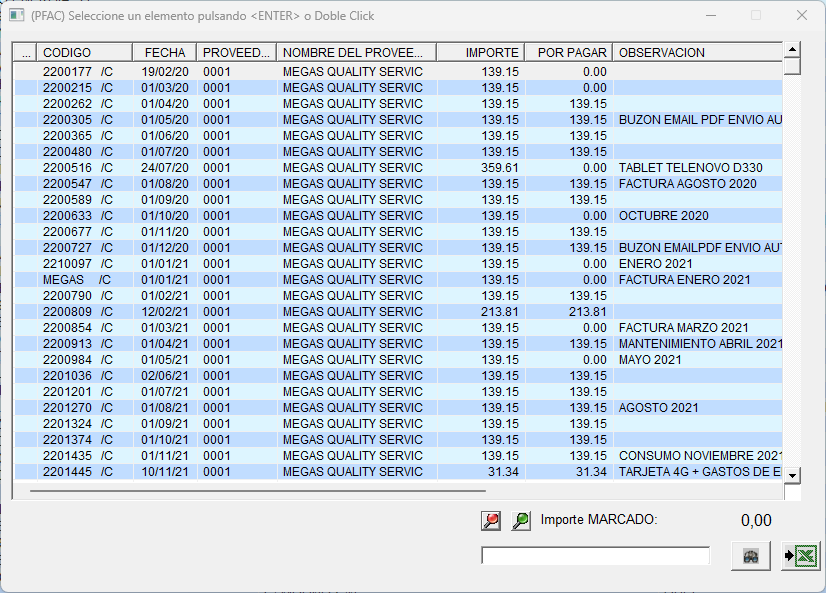
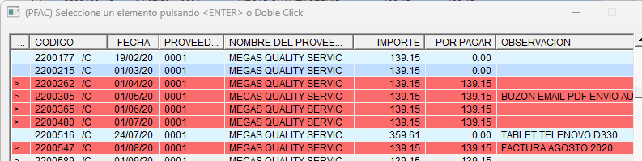

:::warning

Las opciones de:

    * Cubo de decisión
    * Google maps

dejarán de ser funcionales en las próximas actualizaciones.

:::

## Proveedores

En este apartado encontraremos todo lo relacionado a nuestros proveedores.

Una vez ingresemos al apartado de proveedores nos encontraremos la siguiente pantalla

> *Procederemos a explicar la botonera de izquierda a derecha*

* **Salir**: Sale de la pantalla actual (Esc).
* **Primero**: Nos lleva al primer registro.
* **último**: Nos lleva al último registro creado.
* **Anterior**: Nos desplaza al registro anterior. ***(Ctrl + izq)***
* **Siguiente**: Nos desplaza al siguiente registro. ***(Ctrl + drch)***
* **Alta**:  Da de alta un nuevo registro. ***(Ctrl + A)***
* **Baja**: Da de baja el registro actual. ***(Ctrl + B)***
* **Modificar**: Modifica el registro actual. ***(Ctrl + M)***
* **Impresión**: Nos permite imprimir dos listados referentes al proveedor seleccionado. Ficha del proveedor o estado de cuenta. ***(Ctrl + I)***
* **Exportar a excel**: Exporta la ficha del proveedor a Microsoft Excel.
* **Calculadora**: Abre la calculadora del sistema.
* **Búsqueda**: Realiza una búsqueda de registro introducciendo el código de proveedor o introduciendo bien parte de su descripción o mediante **"*"** y parte del registro.
* **Precios Especiales**: Nos permite visualizar los precios especiales que nos aplica el proveedor.
* **Pedidos/Albaranes**: Permite visualizar los pedidos/albaranes de compra realizados a este proveedor.
* **Facturas**: Permite visualizar las facturas realizadas a este proveedor.
* **Vencimientos**: Muestra una selección de vencimientos que permite filtrar por vencimientos pagados, no pagados o todos. Al hacer clic sobre el vencimiento en cuestión nos llevará a el. Pulsando escape (ESC) nos devuelve a la pantalla de proveedores.
* **Memo**: Información en texto libre para el proveedor.
* **Gráfica**: Muestra un gráfico con el consumo comparativo de los años anteriores. ***siempre y cuando existan datos***.
* **Artículos pendientes de suministro**: Muestra los artículos del proveedor que están pendientes de servir.
* **Otras direcciones**: Permite registrar otras direcciones, personas de contacto y telefonos del proveedor.
* **Cheques/Pagares**: Permite imprimir un cheque o pagaré al proveedor seleccionado.
* **Cubo de decisión**: Exporta a un programa de minería de datos las diferentes estadísticas del proveedor seleccionado. ***En desuso***.
* **Google Maps**: Permite visualizar la ubicación del proveedor en Google Maps siempre y cuando la dirección esté introduccida correctamente. ***En desuso***.
* **Documentos asociados**: Nos muestra una pantalla donde podemos registrar los documentos asociados al proveedor.
<!-- Introduccir redirección a documentos ascociados. -->

### Alta de un proveedor

Mediante la combinación ***Ctrl + A*** se nos mostrará una pantalla donde podremos rellenar los datos de un nuevo proveedor.

> Usaremos los datos de nuestra empresa como ejemplo.

:::info
Como hemos visto en otros apartados de la aplicación, nos irá pidiendo unos datos de carácter obligatorio que nos mostrará un mensaje de error ante la ausencia o erronea introducción.
:::

* **Código proveedor**: Código numerico para identificar a proveedor. Al igual que en los clientes es recomendable usar una codificación de cinco dígitos.
* **Proveedor**: Nombre del proveedor.
* **Nombre-1**: Nombre resumen del proveedor.
* **Dirección**: Dirección fiscal del proveedor.
* **Población**: Población y código postal del proveedor. Sigue la codifiación de Código Postal - Ciudad.
* **Provincia**: Provincia.
* **Telefono 1-2**: Teléfono principal del proveedor y un teléfono secundario.
* **CIF/DNI**: CIF del proveedor.
* **Observación**: Observación importante libre del proveedor.
* **Código pago C**: Código de pago para serie C.
* **Código pago F**: Código de pago para serie F.
* **Descuento Linea C**: Descuento en tanto por ciento % que se aplicará a **cada linea de pedido o albarán de compra** del proveedor.
* **Descuento Linea F**: Descuento en tanto por ciento % que se aplicará a **cada linea de pedido o albarán de compra en F** del proveedor.
* **Cuenta Bancaria/IBAN**: Campo reservado para la cuenta bancaria del proveedor.
* **IVA C/F**: Campos con dos posibles valores, S(Sí)/N(No). Determina si se aplicará IVA a los documentos del proveedor.
* **Rec. Equiv C/F**: Campos con dos posibles valores, S(Sí)/N(No). Determina si se aplicará recargo de equivalencia a los documentos del proveedor.
* **Observación 1/2**: Campos de texto libre reservados para observaciones.
* **Tarifa**: Tarifa de compra que se aplicará automaticamente a los articulos que compremos del proveedor. Por defecto 0 - Coste.
* **Email**: Campo reservado para introduccir el email o emails del proveedor.
* **Activo**: Campo con dos posibles valores, S(Sí)/N(No), indica el estado del proveedor.
* **Regalo a cargo del proveedor**: ***POR RELLENAR***
* **Dto a cargo del proveedor**: ***Por rellenar***
* **Dia de Pago 1**: Primer día en el cua se girará la factura de compra.
* **Dia de Pago 2**: Segundo día en el cual se volverá a girar la factura en caso de impago en el dia 1.
* **Pais**: País del proveedor.
* **Fax**: Fax del proveedor.
* **Cuenta contable**: Cuenta contable asociada al proveedor. Se rellena automáticamente siempre y cuando se use una **codificación de cinco dígitos** en el **código de proveedor**.
* **Cuenta Contrapartida**: Cuenta destinada a la contrapartida del proveedor en caso de que también sea acreedor.
* **Cuenta Pago**: Cuenta destinada al pago del proveedor.
* **Cuenta Manipulación**: Cuenta destinaada a la manipulación.
* **Formato C/F**: Campo destinado a la introducción de un formato especifico. Si se rellena este campo se usará el informe especificado en vez de el informe por defecto.
* **Albaranes Pendientes**: Campo automático que muestra el saldo de albaranes pendientes de pago.
* **Saldo**: Campo automático que muestra el saldo total del proveedor.
* **PVP Albarán nacional**: Permite seleccionar el precio de venta final para los albaranes a terceros.
Por defecto se coge el PVP-1 de la ficha del cliente.

### Pago rápido de facturas

Mediante el botón de facturas podremos filtar por las facturas pagadas, no pagadas o ambas, lo cual mostrará por pantalla un listado de las facturas del proveedor.

Podremos ir clicando las facturas que deseemos o usar los botones de ***Marcar Todos***   lo que nos seleccionará todas las facturas o ***Desmarcar Todos***  lo que nos desmarcará las facturas seleccionadas.

Las facturas seleccionadas se mostrarán con color rojo en el listado mostrado por pantalla.

Con la tecla escape(ESC) nos devolverá a la pantalla principal de proveedores con una ventana emergente,

La cual nos pedira el concepto del pago, la fecha de vencimiento y la cuenta contable destino.

:::info
Este proceso dará por pagadas las facturas y sus correspondientes vencimientos automáticamente.
:::

### Estadísitcas de compra Proveedor

Mediante la funcionalidad de imprimir (***Ctrl + I***) podremos sacar varios listados respecto al proveedor seleccionado.

Una vez entremos en ***Estadísitcas de Compras*** se nos mostrará una ventana emergente donde tendremos que rellenar varios datos.

* **Fecha Inicial/Final**: Rango de fechas que deseamos filtar.
* **Tipo C/F**: Filtro de albaranes en serie C, F o ambos.
* **Clase 1-3**: Permite fitrar por 3 clases de artículo.

:::warning
Para poder usar esta funcionalidad deberemos tener bien definidas las clases de nuestros artículos <!-- Introduccir redirección a clases de artículo -->
:::

* **Familia**: Permite filtrar por familia de artículo.
* **Proveedor**: En el caso de que no seleccionemos previamente un proveedor antes de usar el listado deberemos introducir manualmente el código de proveedor.
**Si hemos seleccionado el proveedor antes de usar el listado, deberemos dejar el campo en blanco.**
* **Imprimir**: Campo con dos posibles valores:
  * **Pantalla**:  Mostrará el consumo mediante una nueva pantalla.
  * **Imprimir**: Monstrará el consumo mediante un listado que podremos imprimir.

#### Estadísticas de compra - Pantalla

Si elegimos la primera opción se nos mostrará la siguiente pantalla:

la cual nos mostrará de una manera gráfica el consumo de cada artículo perteneciente al proveedor.

* **Código**: Código del artículo.
* **Artículo**: Nombre del artículo.
* **Unidades**: Unidades compradas en el **año en curso**.
* **Unidades Anteriores**: Unidades compradas en el **año anterior**

:::info
Para poder ver este dato es necesario que existan datos.
:::

* **Regalo**: Unidades regaladas.
* **Litros**: Total de litros consumidos.
* **Importe**: Importe **bruto** total por artículo.
* **Último PVP**: Último precio de compra registrado.

:::info
Se actualiza automáticamente en el caso de que cambie el PVP de compra en los albaranes de compra. Se registra **siempre** el último.
:::

* **Último %**: por rellenar
* **Tarifa 1**: Por rellenar.

#### Estadísticas de compra - Impresora

Esta opción nos mostrará por pantalla un informe el cual podremos exportar a pdf o cualquier formato de nuestra conveniencia al igual que imprimirlo.

***POR RELLENAR***

### Ficha del Proveedor

Si seleccionamos esta opción nos sacará por pantalla un informe con todos los datos del proveedor para imprimir.

### Estado de cuenta

Mediante esta opción podremos sacar un informe contable referente al estado de las cuentas del proveedor.
Se nos mostrará una pantalla para poder filtar la información que deseamos sacar.

.

