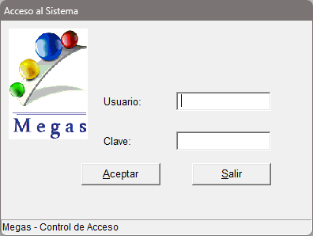
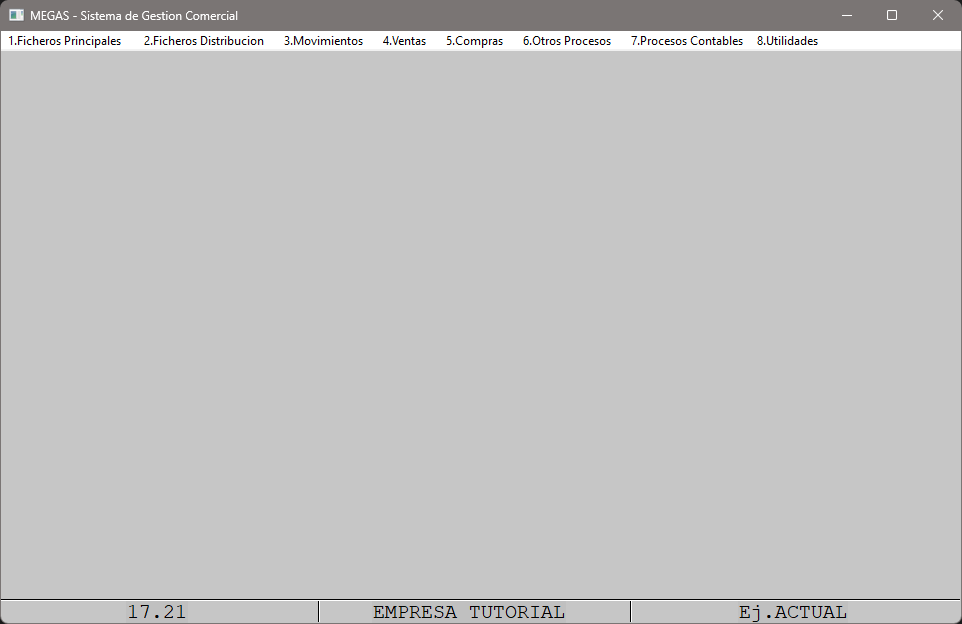

## Pantalla de acceso

Después de hacer doble clic sobre el icono de la aplicacón de gestíon aparece una ventana donde podremos acceder con nuestro usuario y contraseña.

Por defecto el usuario es **MASTER** y la contraseña en **BLANCO**.

## Pantalla Principal

Una vez hallamos accedido mediante nuestro usuario y contraseña encontraremos la pantalla principal.

Cada componente incluye un grupo de funciones y sus anexos a los cuales podremos acceder clicando encima de cada uno o moviendonos mediante atajos de teclado.