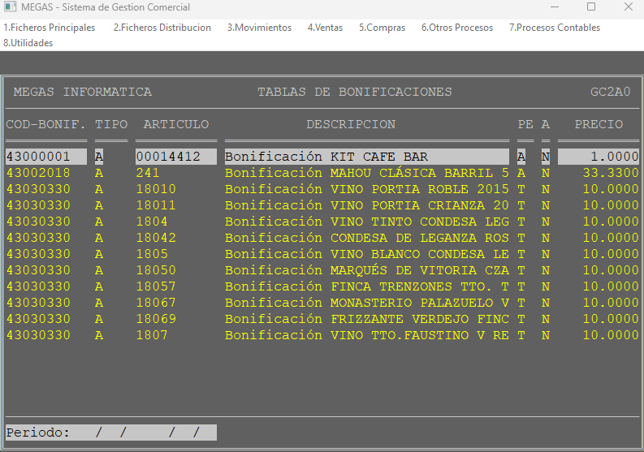
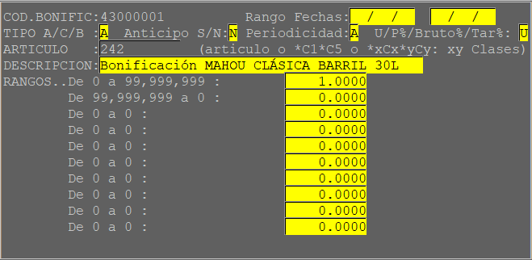

## 1.5.C - Tablas de Bonificaciones

Permite definir las bonificaciones que se aplicarán a un artículo, caja o barril.

### Alta de bonificaciones

Mediante el botón de alta (Ctrl + A) se nos mostrará la pantalla de Alta:

* **Código Bonificación**: Código numérico para la bonificación.
* **Rango Fechas**: Se introduce la fecha de inicio y la fecha final de la bonificación. Si dejamos la fecha inicio vacia nos coge la fecha actual del sistema.
Si dejamos ambas fechas sin introducir la bonificación será de **caracter permanente**
* **Tipo**: Especifica el tipo de artículo, puede ser A(Artículo general), B(Barril) o C(Cajas).
* **Anticipo**: Especifica si la bonificación lleva anticipo o no.
* **Periodicidad**: Especifica la periodicidad de la bonificación, siendo A(Anual), S(Semestral) o T/Trimestral.
* **Artículo**: Especifica el código de artículo sobre la que se aplicará la bonificación.
:::tip Sugerencia
Este campo permite realizar una búsqueda de artículos mediante el comodín **"*"** y parte del nombre del artículo.
:::
* **Descripción**: Descripción de la bonificación.
* **Rangos**: Aparecen los rangos definidos en la pantalla de [rangos de bonificación](Rangos%20de%20Bonificacion.md)
