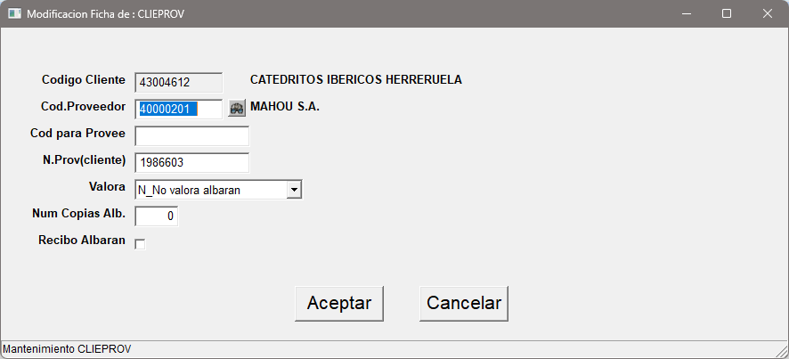

## 1.5.7 - Clientes / Proveedores (Clientes Nacionales)

Permite establecer la correspondencia de los clientes nacionales con los proveedores.

* **Código Cliente**: Código del cliente.
* **Código Proveedor**: Código del proveedor.
* **Código para Proveedor**: Campo destinado a Telynet.
* **Número Cliente del proveedor**: Código de cliente nacional asignado al proveedor.
* **Valora**: Permite especificar el comportamiento del sistema a la hora de facturar.
* **Número de copias albarán**: Especifica el número de copias que se imprimirán del albarán.
* **Recibo Albarán**:

:::warning
Al salir de esta pantalla se **actualizarán automáticamente todos los registros**
:::