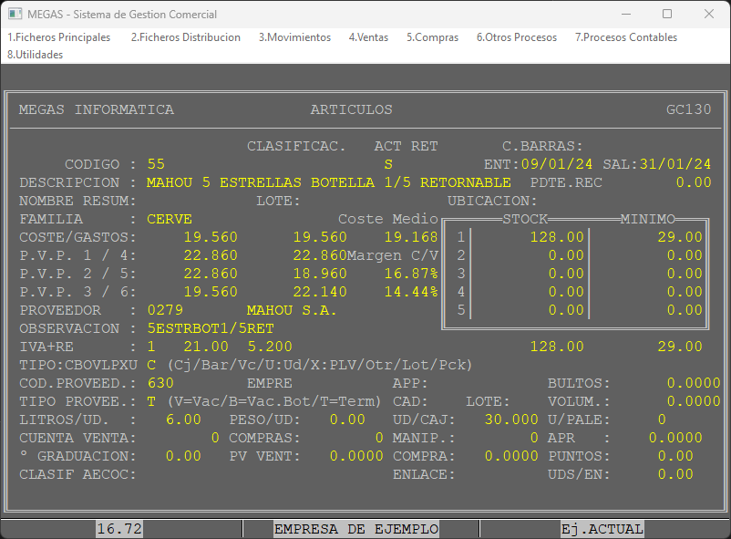

## Artículos

La sección de artículos es crucial para optimizar y gestionar eficicientemente los procesos comerciales de nuestro negocio. Mediante las múltiples funcionalidades y opciones disponibles podremos gestionar el inventario de nuestra empresa asi como sus movimientos.

:::info
**Usaremos el artículo MAHOU 5 ESTRELLAS 1/5 RETORNABLE como ejemplo**
:::

La imagen proporcionada muestra la pantalla principal de la sección de artículos la cual contiene información detallada sobre cada producto de nuestro catálogo.
A continuación desglosaremos los elementos clave de esta pantalla para comprender su funcionalidad y cómo utilizarla de manera adecuada.

#### 1. Indentificación del artículo

* **Código**: Número único que identifica el artículo en el sistema. Puede contener carácteres no numericos.

:::danger
El código es un código **INTERNO** y sólo identifica el producto dentro de nuestro sistema.
:::

* **Descripción**: Nombre detallado del producto.
* **Nombre Resumen**: Versión abreviada del nombre del artículo.

#### 2. Clasificación y estado

* **Clasificación**: Categorización del producto en cinco niveles jerarquicos.
  * **A continuación se muestra una imagen con una jerarquía de niveles:**

    

:::warning
**La correcta clasificación de artículos es de vital importancia para poder sacar las correspondientes estadísiticas.**
:::

* **Activo (ACT)**: Indica si el artículo está activo y por lo tanto se puede vender.
* **Retornable (RET)**: Indica si se trata de un artículo retornable.
* **Código de Barras**: Código de barras del producto.
* **Familia**: Familia a la que pertenece el artículo.
* **Tipo**: Tipo de producto, se divide en los siguientes:
  * **C**: El artículo es de tipo **Caja.**
  * **B**: El artículo es de tipo **Barril.**
  * **O**: El artículo es de tipo **Otros.**
  * **V**: El artículo es de tipo **Vacío.**
  * **L**: El artículo es de tipo **Lote.**
  * **P**: El artículo es de tipo **Pieza.**
  * **X**: El artículo es de tipo **PLV.**
  * **U**: <!-- Por rellenar -->

#### 3. Costos y Precios

* **Coste/Gastos**: Precio de compra del artículo, admite hasta tres decimales.
* **PVP 1-6**: Distintas tarifas de venta al público. Por defecto siempre se aplica la tarifa 1.

:::info
Todos los precios PVP son **SIN IVA**. Este dato se calcula de manera automática
:::

* **Coste Medio**: Campo automático que muestra el coste medio del producto.
* **Margen C/V**: Margen de beneficio en % de compra y de venta del producto.

* **IVA+RE**: Tipo de IVA que se aplicará al producto.

#### 4. Inventario

* **Stock**: Stock divido en dos columnas principales, **Actual** y **Mínimo**, además disponemos de cinco almacenes independientes.

    El stock actual es la cantidad **real** de producto que disponemos en nuestro almacen.

    El stock mínimo es la cantidad **mínima** recomendada de producto en nuestro almacen. Cuando esta cantidad sea superada el programa avisará de la situación en cada operación que sea incluido el producto en cuestión.

* **Ubicación**: Campo libre donde se puede introducir la ubicación de nuestro artículo

#### 5. Proveedor

* **Proveedor**: Código de proveedor que nos suministra el producto.
* **Código Proveedor**: Código del artículo que nos asigna el proveedor.
* **Tipo de proveedor**: Indica si el artículo es una caja con botellas vacías, un barril vacío, o un producto lleno dispuesto a ser vendido, terminado. **Todos los productos de Mahou deberán tener este campo relleno.**

#### 6. Detalles adicionales

* **EMPRE**: Empresa perteneciente. En caso de que dispongamos de multiempresa, podremos asignar a que empresa pertenece el artículo.
* **APP**: Código de aplicación. Campo reservado para la comunación a aplicaciones externas.
* **Bultos**: Bultos que ocupa el producto en el camión.

:::tip[**Campos recomendables**]
La siguiente información es muy recomendable tenerla rellena adecuadamente para poder obtener unas estadísticas precisas y reales.
:::

* **Litros/UD**: Litros totales por unidad.
* **Peso/UD**: Indica cuantos KG tiene el artículo en su totalidad.
* **Ud/Caja**: Unidades totales que compone una caja.
* **Ud/Palé**: Unidades totales de cajas que conforman un palé.
* **Cuenta Venta**: Cuenta contable asociada a la venta de este artículo.
* **Cuenta Compras**: Cuenta contable asociada a la compra de este artículo.
* **Cuenta Manipulación**: Cuenta contable asocaida a lo percibido por la manipulación de este artículo.
* **APR**: Ayuda por reparto. Cantidad percibida por repartir el artículo.
* **º Graduación**: Campo destinado a aquellos concesionarios que además fabriquen alcohol. En este campo se detallará los grados del producto.
* **Punto Verde Venta**: Cantidad en euros por artículo correspondiente al punto verde para las ventas.
* **Punto Verde Compras**: Cantidad en euros por artículo correspondiente al punto verde para las compras.
* **Puntos**: Vallor en puntos que genera la venta de este artículo. Se usa para las promociones por puntos.
* **Enlace**: Código del artículo al cual enlaza.
* **UDS/EM**: Unidades de enlace.

:::warning[Enlace artículos]
En el sistema de gestión comercial MEGAS, la función de "Enlace" es utilizada en situaciones donde un mismo artículo es suministrado por dos proveedores diferentes, pero debe ser gestionado bajo un único inventario. Este procedimiento es esencial para mantener una consistencia en el control de stock y optimizar la gestión de inventarios múltiples.

**Caso de Uso de la Función de Enlace:**

Considere el artículo con el código 55, "Mahou 5 Estrellas". Este mismo artículo también puede estar registrado bajo un código diferente, como el código 200, que representa al mismo producto, pero provisto por un segundo proveedor. En esta circunstancia, la función de enlace permite que ambos códigos se gestionen como un único stock.

Configuración del Enlace:

Código Principal (Enlace): 200
Unidades de Enlace: 1
Al configurar el artículo 55 con un enlace al código 200, se establece que cualquier transacción que afecte al artículo 55 también afectará proporcionalmente al artículo 200. Por ejemplo, al vender una unidad del artículo 55, el sistema descontará automáticamente una unidad del artículo 200.
:::
