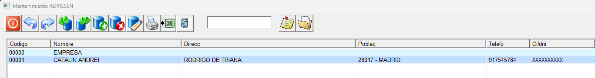
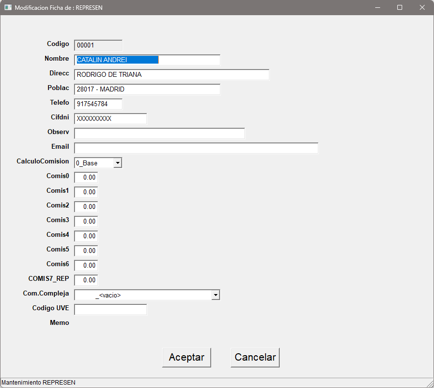

## Representantes

En esta pantalla se definen aquellos empleados que realicen la función de comerciales o preventistas con el fín de controlar todas las ventas que estos generen.

Desde esta pantalla obtenemos un vistazo rápido de los representantes que tenemos dados de alta en nuestro sistema a su vez podremos realizar las distintas operaciones (Alta, baja, modificación) sobre ellos.

Al dar de alta un nuevo registro o modificar uno existente se nos mostrará la siguiente pantalla: 

* **Código**: Código para la identificación del representante. Puede contener carácteres no numericos. En el caso de modificación el campo aparece bloqueado con el código existente.
* **Nombre**: Nombre del representante.
* **Dirección**: Dirección del representante.
* **Población**: Población del representante. Debe introducirse como CP-POBLACION (Código postal - población).
* **Teléfono**: Teléfono del representante.
* **Cif Dni**: Cif/nif/Dni o nie del representante.
* **Observación**: Campo libre para observaciones del representante
* **Email**: Campo destinado a un email o varios email del representante.
* **Calculo comisión**: Desplegable que nos permite seleccionar entre 3 valores distintos sobre los cuales se realizará el cálculo de la comisión.
    * **0 (BASE)**
    * **1 (TOTAL)**
    * **2 (BRUTO)**
* **Comisión 0-6**: Porcentaje de comisión, por defecto se usará la comisión 0.
* **Comisión Compleja**: Campo destinado al código de comisión compleja.
* **Código UVE**:
