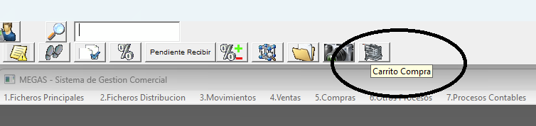
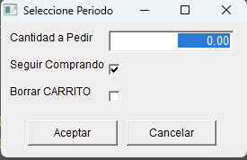
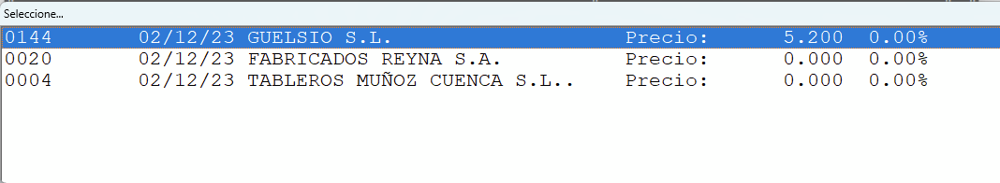

# Notas de versión 16.70

## Nuevas Funcionalidades

Se ha añadido la funcionalidad de "carrito de compras".
Permite ir marcando los artículos que deseemos para hacer posteriormente un pedido de compra. Se permite que los artículos sean de diferente proveedor.

.

Si hay más de un proveedor que nos ha servido el artículo nos permitirá elegir el que más nos convenga, si solo hay uno se selecciona automáticamente.

 

Una vez seleccionado el proveedor muestra el estado del carrito de compra con los productos acumulados pudiendo incorporar productos manualmente.

Al desmarcar "Seguir Comprando", el programa nos generará tantos pedidos de compra como proveedores distintos, haciendo un recorrido sobre cada pedido por si deseamos imprimirlos o mandarlos por email.

## Correcciones

Se ha realizado una modificación para que los pedidos recogidos a través de Telynet (Coca-Cola) apliquen correctamente el impuesto de punto verde.

:::danger Recordatorio

**Recordamos a todos los clientes que deben ponerse en contacto con el soporte técnico de Megas a través del telefono de la oficina para proceder a la actualización.**

:::